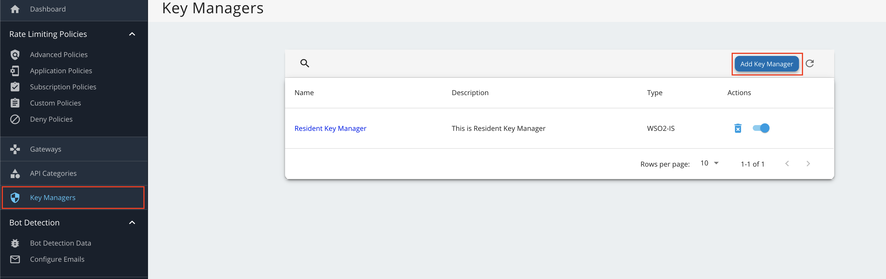

This guide provides step-by-step instructions to configure WSO2 Identity Server 7.x as a Key Manager for WSO2 API Manager, enabling secure API access and management.

1. Sign in to the Admin Portal of API Manager at https://localhost:9443/admin.
2. Go to **Key Managers** on the left main menu.

3. Configure [WSO2 IS 7.x as a keymanager](https://apim.docs.wso2.com/en/latest/api-security/key-management/third-party-key-managers/configure-wso2is7-connector/). Enable role creation in WSO2 Identity Server 7.
:::tip
You can configure well-known URL (`https://<WSO2_APIM_BASE>:9453/oauth2/token/.well-known/openid-configuration`) and import Key manager endpoints.
:::

:::note
Use the introspection endpoint in the iam-service-extension service to enable healthcare specific introspection response. `https://<IAM_SERVICE_EXTENSION_BASE>:<PORT>/introspect`.
:::
4. Go to the list of Key Managers and select **Resident Key Manager**.
5. Disable the Resident Key Manager.