import Tabs from '@theme/Tabs';             
import TabItem from '@theme/TabItem';

# Configuring SMART on FHIR for Standalone Launch

This integration leverages WSO2 IS as the OAuth 2.0 / OpenID Connect authorization server and WSO2 APIM as the FHIR API gateway.

In this guide, we will walk through the steps to configure the SMART on FHIR flow using the Healthcare Accelerator.

## Prerequisites
1. Install and setup the [WSO2 API Manager for Healthcare](../../install-and-setup/manual.md#setting-up-wso2-api-manager-for-healthcare) and [WSO2 Identity for Healthcare](../../install-and-setup/manual.md#setting-up-wso2-identity-server-for-healthcare).
2. Setup [IS as Third Party Key Manager](../../install-and-setup/configure-km) for APIM.
3. Running FHIR server.
4. Published FHIR APIs in WSO2 APIM.

## Step 1 - Setting Up
### 1. Create management application.

   This application will be used to get an access token to access the management
   APIs by the supporting Ballerina services.
    
- Log in to the IS Admin Console(https://localhost:9453/console).
- Create an application of type M2M.
  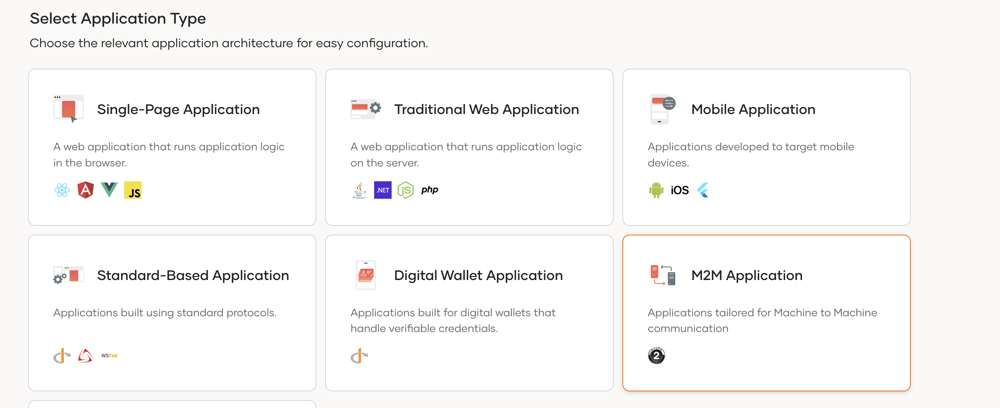
- Go to the 'Protocols' section of the application and copy the 'Client ID' and 'Client secret' values. 
 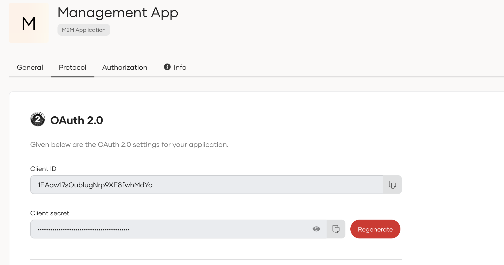
These values will be used in the Ballerina services to securely access the management APIs.
   
### 2. Setup and Deploy Pre built Ballerina services

Service extensions required for the SMART on FHIR flow are available in the [WSO2 Healthcare Accelerator](https://github.com/wso2/healthcare-accelerator/tree/main/extensions/services) GitHub repository.
- Clone the repository and navigate to the `extensions/services` directory.
  - consent-app-bff is the backend service for the consent app which will be used to capture the patient consent during the SMART on FHIR flow.

    <details>
    <summary>Click here to see more about consent-app-bff service</summary>
    <div>
    
    **consent-app-bff** is the backend for the consent app frontend which is a React application that provides the user 
    interface to capture patient consents during the SMART on FHIR flow. Consent app bff exposes APIs to capture and 
    manage patient consents and also serves the consent app frontend.
    
    Configure the `Config.toml` file of the service extension.
  
    | Key                                   | Description                                                                                                                                                                                                        | Example Value                            |
    |---------------------------------------|--------------------------------------------------------------------------------------------------------------------------------------------------------------------------------------------------------------------|------------------------------------------|
    | `hostname`                            | Hostname of the service                                                                                                                                                                                            | `localhost`                              |
    | `port`                                | Port on which the service will run                                                                                                                                                                                 | `9092`                                   |
    | `corsAllowedOrigin`                   | Allowed origin for CORS configuration to allow the consent app frontend to call the APIs exposed by this service.                                                                                                  | `http://localhost:3000`                  |
    | `idpBaseUrl`                          | Base URL of the Identity Server instance. This will be used to call the management APIs to manage consents.                                                                                                        | `https://localhost:9453`                 |
    | `idpTokenEndpoint`                    | Token endpoint of the Identity Server instance. This will be used to obtain access tokens to call the management APIs.                                                                                             | `https://localhost:9453/oauth2/token`    |
    | `consentContextApiTrustStorePath`     | Path to the truststore file containing the certificates required to establish SSL connection with the Identity Server when calling the management APIs.                                                            | ``                                       |
    | `consentContextApiTrustStorePassword` | Truststore password. This will be used to establish SSL connection with the Identity Server when calling the management APIs.                                                                                      | ``                                       |
    | `clientId`                            | Client ID of the management application created in the previous step. This will be used to obtain access tokens to call the management APIs.                                                                       | ``                                       |
    | `clientSecret`                        | Client secret of the management application created in the previous step. This will be used to obtain access tokens to call the management APIs.                                                                   | ``                                       |
    | `ehrContextResolveUrl`                | EHR launch context endpoint URL. This will be used to resolve the patient ID from the EHR launch context if `launch` scopes present in the token request.                                                          | `https://ehr.example.com/launch-context` |
    | `consentFlow`                         | Type of the consent flow to be used. Supported values are `scope` and `purpose`. For SMART on FHIR use `scope` as the value                                                                                        | `scope`                                  |
    | `openfgcBaseUrl`                      | Base URL of the OpenFGC instance. This will be used as the consent management system to capture and manage patient consents during the SMART on FHIR flow.                                                         | `http://localhost:8080`                  |
    | `orgId`                               | Organization ID to be sent in the OpenFGC request headers. This will be used as the consent management system to capture and manage patient consents during the SMART on FHIR flow.                                | ``                                       |
    | `tppClientId`                         | Client ID to be sent in the OpenFGC request headers. This will be used as the consent management system to capture and manage patient consents during the SMART on FHIR flow.                                      | ``                                       |
    | `consentType`                         | Consent type to be sent in the OpenFGC request body when creating a consent. This will be used as the consent management system to capture and manage patient consents during the SMART on FHIR flow.              | `patient-access`                         |
    | `alwaysAllowedScopes`                 | List of scopes that bypass consent checks in the consent app. This will be used to allow certain scopes without requiring explicit patient consent during the SMART on FHIR flow.                                  | `["openid", "internal_user_mgt_list"]`   |
    | `singleConsentPerUser`                | Whether to allow only a single active consent per user. If set to true, when a new consent is created for a user, any existing active consents for that user will be revoked.                                      | `true`                                   |
    | `showConsentElements`                  | Whether to show the consent elements in the consent app frontend. If set to true, the scopes and purposes will be shown in the consent app frontend to allow users to make informed decisions when giving consent. | `false`                                  |
    | `scopeConsent.purposeName`             | Purpose name to be sent in the OpenFGC request body when creating a consent for a scope. This will be used as the consent management system to capture and manage patient consents during the SMART on FHIR flow.  | `SMART on FHIR Consent`                  |

      </div>
      </details>

  - iam-service-extensions contains the service extensions for the Identity Server.

    <details>
    <summary>Click here to see more about iam-service-extensions service</summary>
    <div>

    **iam-service-extension** is a Ballerina service that contains the following extensions to enhance the token issuance and introspection flows in IS to support SMART on FHIR use cases.

    - **Pre-issue access token extension**(`/pre-issue-access-token`) — Invoked before issuing an access token. Adds healthcare specific claims such as `patient` and `consent_id` to the access token based on the user and the context of the request.
    - **Pre-issue ID token extension**(`/pre-issue-id-token`) — Invoked before issuing an ID token. Adds the `fhirUser` claim to the ID token based on the user and the context of the request.
    - **Introspection extension**(`/introspect`) — Invoked during token introspection. Adds healthcare specific information to the introspection response based on the token and the context of the request.

    </div>
    
    <div>
    
    Configure the `Config.toml` file of the service extension.
  
    | Key                     | Description                                                                                                                                               | Example Value                            |
    |-------------------------|-----------------------------------------------------------------------------------------------------------------------------------------------------------|------------------------------------------|
    | `hostname`              | Hostname of the service                                                                                                                                   | `localhost`                              |
    | `port`                  | Port on which the service will run                                                                                                                        | `9093`                                   |
    | `openfgcBaseUrl`        | Base URL of the OpenFGC instance                                                                                                                          | `http://localhost:8080`                  |
    | `orgId`                 | Organization ID to be sent in the OpenFGC request headers                                                                                                 | ``                                       |
    | `tppClientId`           | Client ID to be sent in the OpenFGC request headers                                                                                                       | ``                                       |
    | `ehrContextResolveUrl`  | EHR launch context endpoint URL. This will be used to resolve the patient ID from the EHR launch context if `launch` scopes present in the token request. | `https://ehr.example.com/launch-context` |
    | `isBaseUrl`             | Base URL of the IS instance. This will be used for SCIM lookup and token introspection.                                                                   | `https://localhost:9453`                 |
    | `scimApiPath`           | Path to the SCIM API. Defaults to `/scim2/Users` if not provided.                                                                                         | `https://localhost:9453/scim2/Users`     |
    | `scimClientId`          | OAuth2 client ID for SCIM API authentication. This client should have necessary permissions to call the SCIM API.                                         | ``                                       |
    | `scimClientSecret`      | OAuth2 client secret for SCIM API authentication.                                                                                                         | ``                                       |
    | `scimTokenEndpoint`     | Token endpoint to obtain the SCIM API access token.                                                                                                       | `https://localhost:9453/oauth2/token`    |
    | `scimPatientGroupName`  | Name of the user group used to identify patient users in the SCIM lookup.                                                                                 | `patient`                                |
    | `fhirUserAttributeName` | Name of the SCIM custom attribute that holds the FHIR user reference.                                                                                     | `fhirUser`                               |
    | `alwaysAllowedScopes`   | List of scopes that bypass consent checks in the pre-issue access token extension.                                                                        | `["openid", "internal_user_mgt_list"]`   |
    | `trustStorePath`        | Path to the truststore file containing the certificates required to establish SSL connection with other components.                                       | ``                                       |
    | `trustStorePassword`    | Truststore password                                                                                                                                       | ``                                       |
    
    </div>
    </details>

- Go to each service directory and build the service.
    ```bash
    $ bal build
    ```
- Create a `Config.toml` file and add the required configurations. You can refer to the sample `Config.toml.example` files available inside each of the service.
  - Start the services using the following command. 

    <Tabs>
    <TabItem value="ballerina" label="Ballerina" default>
    
    ```bash
    $ bal run
    ```
    
    </TabItem>
    <TabItem value="java" label="Java">
    
    ```bash
    $ java -jar target/bin/<service-jar-file>.jar
    ```
    
    </TabItem>
    </Tabs>

    :::note
    You can use the client credentials of the management application created in the previous step to configure the services to access the management APIs securely.
    :::

### 3. Configure Pre-Issue Extensions

- Log in to the IS Console (https://localhost:9453/console).
- Navigate to the Actions section from the left menu.
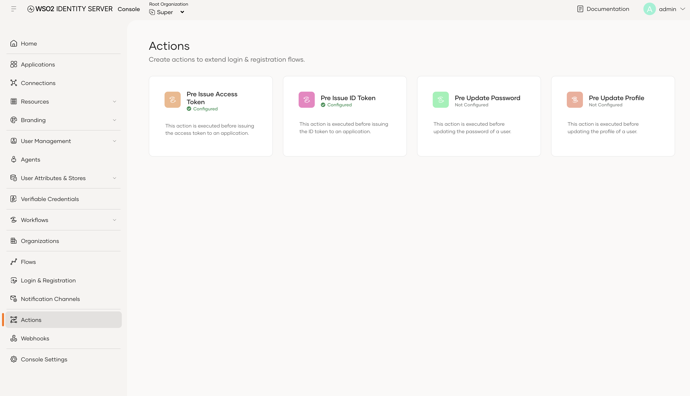
- Setup `Pre Issue Access Token` and `Pre Issue ID Token` actions with the iam-service-extensions Ballerina service path.
    ```text
    Pre Issue Access Token - https://<pre-issue-extension-base-path>:<PORT>/pre-issue-access-token
    Pre Issue ID Token - https://<pre-issue-extension-base-path>:<PORT>/pre-issue-id-token
    ```
  
### 4. Create user attributes.
  - Log in to the IS Admin Console (https://localhost:9453/console).
  - Go to `User Attributes & Stores -> Attributes` and create new user attributes.
    - patient 
    - practitioner 
    - fhirUser 
    
    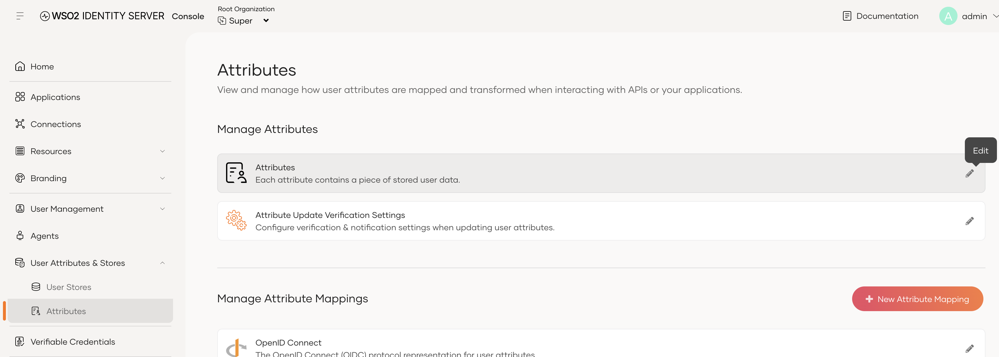
    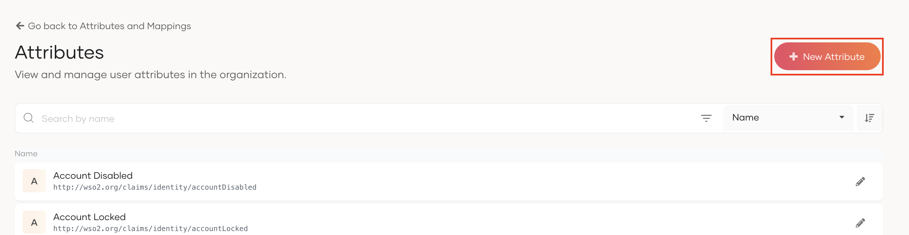
    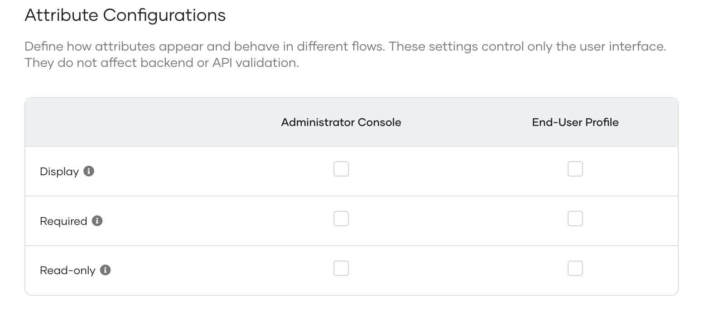
  - In the `fhirUser` attribute, mark **Required** for Administrator Console and End-User Profile under Attribute Configurations.
    
### 5. Create user groups
  - Go to `User Management -> Groups` and create new groups.
    - `patient` - assigned to all patient users.
    - `practitioner` - assigned to all clinical staff users.

  - Add appropriate roles to the groups.
    
  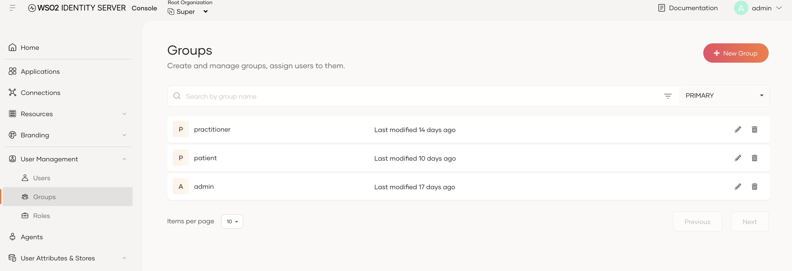
  :::note
  The exact group names used here must be configured in the `Config.toml` of the `pre-issue-access-token-service-extension` (see `patientGroup` and `practitionerGroup` keys).
  :::
    
### 6. Setup [OpenFGC](https://github.com/wso2/openfgc).
  This will be used as the consent management system to capture and manage patient consents during the SMART on FHIR flow. You can follow the instructions in the OpenFGC GitHub repository to set it up.

## Step 2 - Create users and assign roles
1. Go to `User Management -> Users` and create users for testing the SMART on FHIR flow. (e.g., username: `johndoe`).
2. Assign the user to the `patient` group created in the previous step.
3. Create another user (e.g., username: `drsmith`) and assign that user to the `practitioner` group.

## Step 3 - Application Registration and Key Generation
1. Navigate to Developer Portal in your web browser: `https://localhost:9443/devportal/`
2. Sign up by clicking the 'Sign In' button. You will be redirected to the Authentication Portal.
3. Click on 'Create Account' link, provide a username and click on 'Proceed to Self Register'. 
4. Fill in the details and create the account. 
5. Log into Devportal with the credentials of the above user and follow steps 2-4 to [create a new application](https://apim.docs.wso2.com/en/4.2.0/design/api-security/oauth2/grant-types/authorization-code-grant/#try-authorization-code-grant).
6. Enable Refresh Token and Code Grant Types.
7. Enable PKCE.
8. Note down the Consumer key and Consumer Secret. 
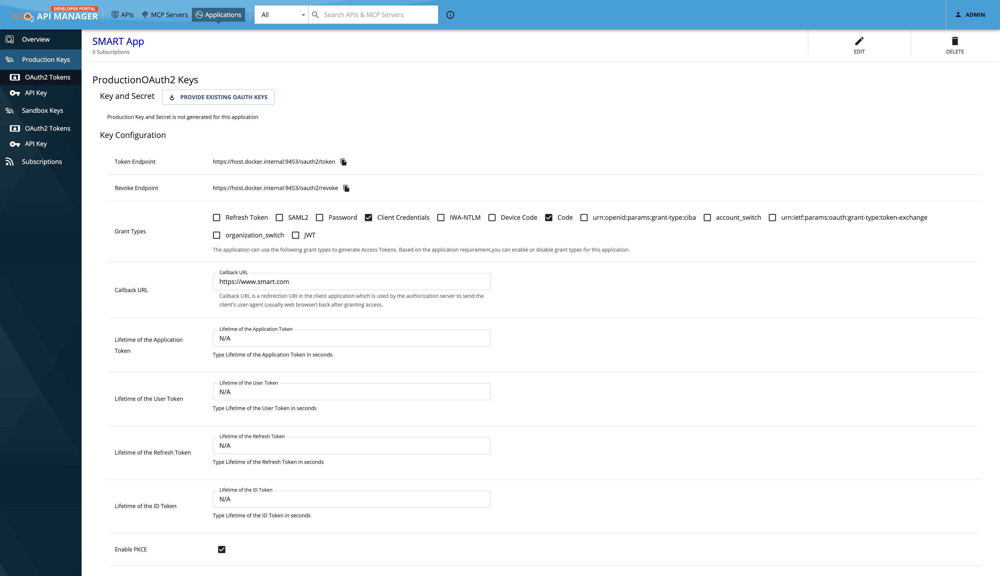

## Step 4 - Subscribe to the FHIR APIs

1. Navigate to the Subscriptions tab of the Developer Portal.
2. Subscribe to the FHIR APIs that you have published in WSO2 APIM using the application you created in the previous step.

## Step 5 - Get the endpoints
1. Invoke the well-known configuration to get the details about auth endpoint and token endpoint. 
`https://localhost:8243/r4/.well-known/smart-configuration`

2. You will get a JSON response as below. 
    ```json
    {
        "response_types_supported": [
            "code",
            "id_token",
            "token",
            "device",
            "id_token token"
        ],
        "capabilities": [
            "launch-standalone",
            "client-public",
            "client-confidential-symmetric",
            "context-standalone-patient",
            "sso-openid-connect",
            "permission-patient",
            "permission-offline"
        ],
        "code_challenge_methods_supported": "S256",
        "grant_types_supported": [
            "authorization_code",
            "client_credentials"
        ],
        "jwks_uri": "https://localhost:9443/oauth2/jwks",
        "revocation_endpoint": "https://localhost:9443/oauth2/revoke",
        "token_endpoint_auth_methods_supported": [
            "client_secret_basic",
            "client_secret_post"
        ],
        "scopes_supported": [
            "openid",
            "launch/patient",
            "patient/*.cruds",
            "user/*.cruds"
        ],
        "issuer": "https://localhost:9443/oauth2/token",
        "authorization_endpoint": "https://localhost:9443/oauth2/authorize",
        "token_endpoint": "https://localhost:9443/oauth2/token"
    }
    ```

## Step 6 - Execute Authorization Code Grant Flow and Retrieve the Patient ID
1. Execute the following request in the URL. 
    
   ```bash
    https://localhost:9443/oauth2/authorize?response_type=code&client_id=[CLIENT_ID]&scope=fhirUser launch/patient offline_access openid patient/DiagnosticReport.s patient/Patient.r&redirect_uri=[REDIRECT_URL]&code_challenge=[CODE_CHALLENGE]&code_challenge_method=S256
    ```

    Replace the `REDIRECT_URL`, `CLIENT_ID` with the values received from Step 3. `CODE_CHALLENGE` is the base64 URL encoded value of the SHA256 hash of a random string (code_verifier) that you generate. You can use online tools to generate the code_challenge and code_verifier values.
    
2. Once redirected to the Authentication Portal sign in with the practitioner or the patient user you created at step 2. 

    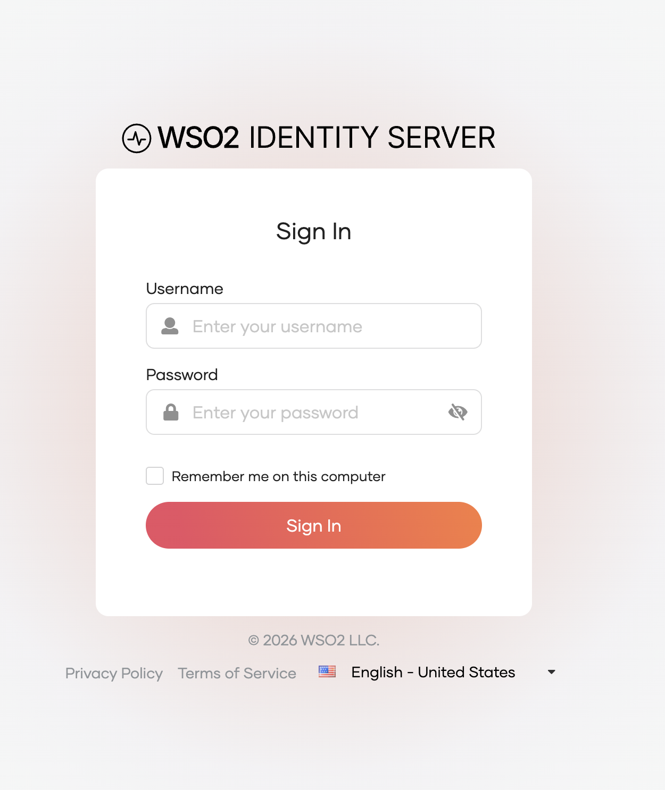
3. Select the permissions and the consent period and click on 'Authorize' button.

    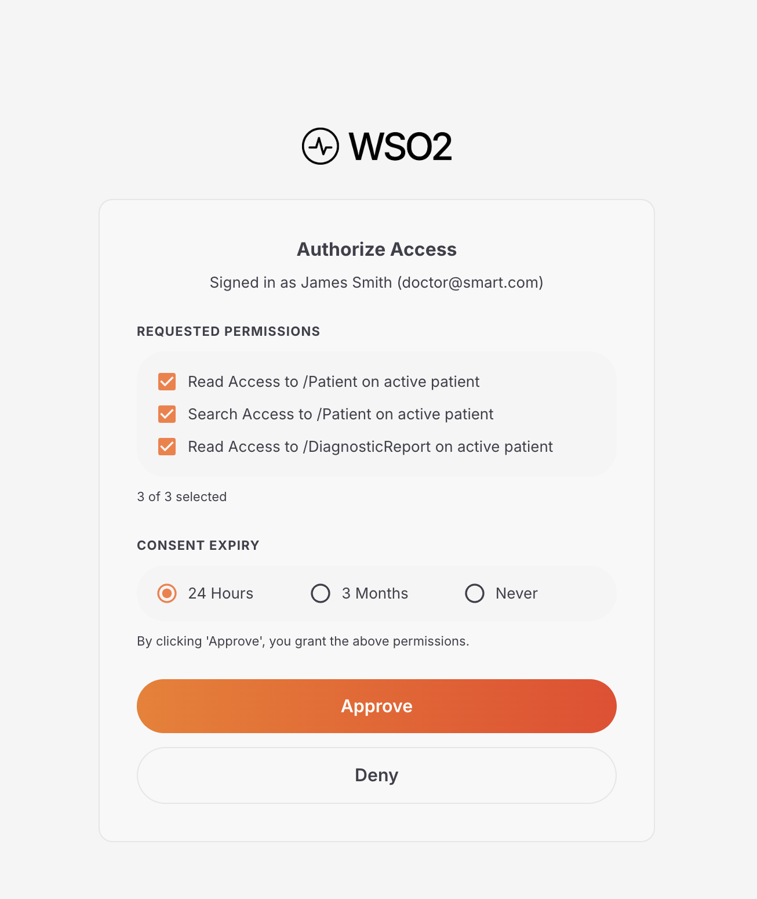
4. If you logged in with the practitioner user, you will be asked to select a patient for the session. Select the patient and click on 'Proceed' button.

    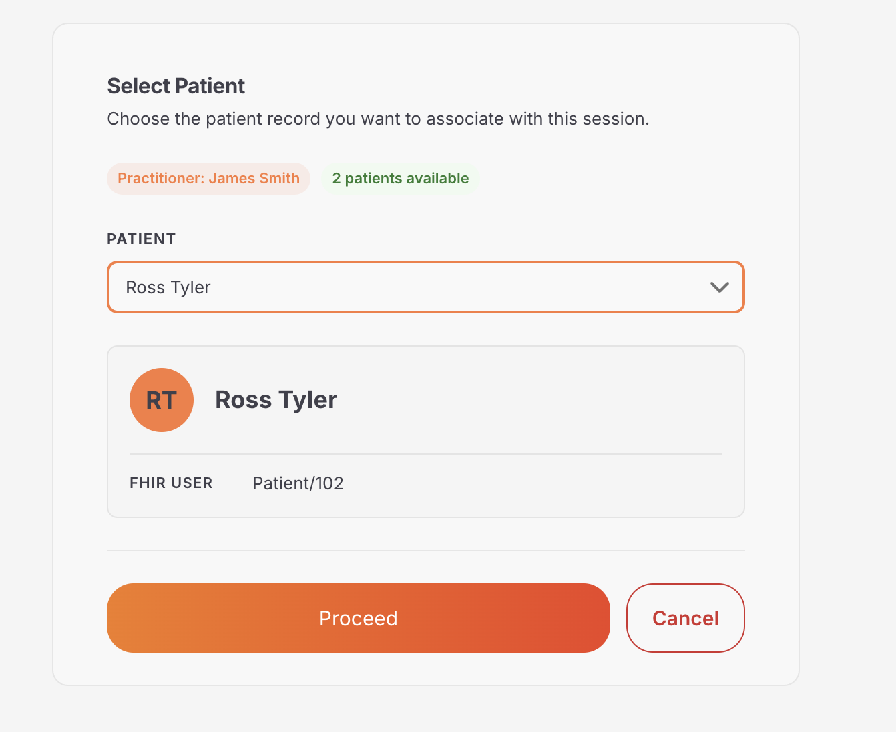
5. Copy the 'code' value from the URL once user is redirected to the configured redirect URL after successful authentication.
6. Execute the following curl command. 
    ```bash
    curl --location --request POST 'https://localhost:9453/oauth2/token?grant_type=authorization_code&code=[CODE_VALUE]&redirect_uri=[REDIRECT_URL]&code_verifier=[CODE_VERIFIER]' \
    --header 'Content-Type: application/x-www-form-urlencoded' \
    --header 'Authorization: Basic <base64>(CONSUMER_KEY:CONSUMER_SECRET)'
    ```
7. You will get the access_token along with the id_token. 
8. Decoded access token looks similar to below.

    ```json
    {
      "sub": "2afba262-dc62-41d6-ad05-30a30c3d6e35",
      "aut": "APPLICATION_USER",
      "iss": "https://host.docker.internal:9453/oauth2/token",
      "client_id": "kp3os6qrkdK1fpFN1tuW4hgRsKwa",
      "aud": "kp3os6qrkdK1fpFN1tuW4hgRsKwa",
      "nbf": 1779172841,
      "azp": "kp3os6qrkdK1fpFN1tuW4hgRsKwa",
      "patient": "102",
      "org_id": "10084a8d-113f-4211-a0d5-efe36b082211",
      "scope": "fhirUser launch/patient offline_access openid patient/DiagnosticReport.s patient/Patient.r",
      "exp": 1779176441,
      "org_name": "Super",
      "iat": 1779172841,
      "jti": "3a5a97a0-563f-40c4-b115-596d43a675d8",
      "consent_id": "b11a7510-73dd-4d29-9834-5903e4cc1b47",
      "org_handle": "carbon.super"
    }
    ```

    :::note
    `consent_id` and `patient` claims are added to the token.
    :::

9. The decoded id token looks similar to below. 

    ```json
    {
      "isk": "e55c51e29b4aa647d8f4d2cc36dd74a017c1b2a4e129152d37eb4efcbc7e5064",
      "at_hash": "9jAg6VhwF7O05KDtmv6o0A",
      "sub": "2afba262-dc62-41d6-ad05-30a30c3d6e35",
      "amr": [
        "BasicAuthenticator"
      ],
      "iss": "https://host.docker.internal:9453/oauth2/token",
      "nonce": "nonce",
      "fhirUser": "Practitioner/232421413",
      "sid": "472df030-be44-49ca-9ddb-a5a54699ffbd",
      "c_hash": "3POJLb9ayH2pNNvFaRWfTg",
      "aud": "kp3os6qrkdK1fpFN1tuW4hgRsKwa",
      "nbf": 1779172842,
      "azp": "kp3os6qrkdK1fpFN1tuW4hgRsKwa",
      "org_id": "10084a8d-113f-4211-a0d5-efe36b082211",
      "org_name": "Super",
      "exp": 1779176442,
      "iat": 1779172842,
      "jti": "6425e15f-bfde-4360-9201-f86e51a8939b",
      "org_handle": "carbon.super"
    }
    ```

    :::note
    `fhirUser` claim is added to the id token.
    :::

## Step 7 - Call FHIR API

Use the `access_token` obtained in Step 6 to call the FHIR APIs published in WSO2 APIM.

1. Include the access token in the `Authorization` header of your API request:

    ```bash
    curl --location 'https://localhost:8243/r4/Patient/[PATIENT_ID]' \
    --header 'Authorization: Bearer [ACCESS_TOKEN]'
    ```

2. Example requests:

    ```bash
    # Retrieve patient demographics
    curl --location 'https://localhost:8243/r4/Patient/102' \
    --header 'Authorization: Bearer [ACCESS_TOKEN]'

    # Retrieve diagnostic reports for a patient
    curl --location 'https://localhost:8243/r4/DiagnosticReport?patient=102' \
    --header 'Authorization: Bearer [ACCESS_TOKEN]'
    ```

:::note
The `patient` claim in the access token (e.g., `"patient": "102"`) contains the Patient ID scoped to the session. Use this value to construct patient-specific FHIR queries.
:::

## See Also

- [Overview - SMART on FHIR](./smart-on-fhir-overview.md)
- [SMART App Launch — HL7 specification](https://hl7.org/fhir/smart-app-launch/)