# Overview - SMART on FHIR

## Securing Health APIs: Why it is essential?

Healthcare APIs play a pivotal role in modern healthcare by enabling systems to seamlessly exchange data across platforms, such as Electronic Medical Records (EMRs) and mobile health applications. However, the sensitive nature of healthcare data, including personal health information (PHI), makes API security a top priority. Unsecured APIs can expose healthcare systems to data breaches, privacy violations, and compliance risks. Therefore, adopting secure practices is essential to maintain the integrity, confidentiality, and availability of patient data.

## How SMART on FHIR builds secure APIs
SMART on FHIR (Substitutable Medical Applications, Reusable Technologies) is an open standard for enabling third-party healthcare applications to securely access FHIR resources. 
SMART on FHIR provides a framework for building secure and interoperable APIs in healthcare. It combines the FHIR standard for data exchange with OAuth 2.0 for authentication and authorization, ensuring secure access to healthcare data. The following are the key ways SMART on FHIR strengthens API security:

1. **OAuth 2.0 for Authentication and Authorization**

   Authorization Code Grant Flow requires users to authenticate with their identity provider (e.g., hospital system or EMR) before receiving an access token. This flow guarantees that apps cannot access health data unless authorized by the user (e.g., clinician or patient). OAuth also supports refresh tokens to extend access securely without re-authentication.

2. **Role-based access control with scopes**

   SMART on FHIR APIs use OAuth scopes to limit what an app can access. Most commonly used scopes are as below.

   - `openid fhirUser`: Permission to retrieve information about the current logged-in user.
   - `launch/patient`: When launching outside the EHR, ask for a patient to be selected at launch time.
   - `offline_access`: Request a refresh token that can be used to obtain a new access token to replace an expired one, even after the end-user no longer is online after the access token expires.

3. **Identity Management and OpenID Connect (OIDC)**

   SMART on FHIR integrates with OpenID Connect to provide identity verification for users. This ensures that healthcare apps can securely verify the identity of the patient or clinician requesting access.

4. **Token-Based Access for Enhanced Security**

   After authentication, SMART on FHIR uses short-lived tokens (OAuth access tokens) to access APIs. Tokens expire quickly, reducing the window of opportunity for unauthorized use if stolen. Applications can request refresh tokens to renew access without asking the user to log in again, maintaining a balance between security and convenience.

## Architecture

The following diagram shows the key components involved in a SMART on FHIR deployment using WSO2 Open Healthcare and how they interact during the authorization and API access flow.

## SMART App Launch Steps
Below are the key steps involved in launching a SMART app and gaining access to FHIR APIs for seamless data exchange.

1. **Launch App: Standalone Launch or EHR Launch**

    A SMART app can be launched in two ways:

    - **Standalone Launch**: The app initiates the login process independently. For example, a patient-facing health web app where the user logs in through an external identity provider connected to the EHR system.
    - **EHR Launch**: The app is opened within the context of an EHR session. For example, a clinician-facing app used during a patient visit, where the EHR passes a launch token containing relevant patient or encounter information to the app.

2. **Retrieve .well-known/smart-configuration**

    The app retrieves the EHR’s .well-known/smart-configuration file to obtain OAuth 2.0 endpoints (authorization and token endpoints) and discover supported scopes and other relevant data for authorization. This step ensures the app interacts with the correct endpoints for secure access.

3. **Obtain Authorization Code**

    The app redirects the user to the authorization endpoint. The user authenticates using their credentials and grants consent to allow the app access to specific scopes. The EHR issues an authorization code to the app through the redirect URI. This code serves as a temporary credential to request an access token.

4. **Obtain Access Token**

    The app exchanges the authorization code for an access token by calling the EHR’s token endpoint. The request includes the client ID, client secret, authorization code, and redirect URI. If successful, the EHR returns an access token. The access token grants the app permission to interact with FHIR APIs on behalf of the user.

5. **Access FHIR API**

    With the access token in hand, the app makes API requests to the EHR’s FHIR server. For example:

    - `GET /Patient/{id}` to retrieve a patient’s demographics.
    - `GET /Observation?patient={id}` to access lab results.

    Each API request includes the access token in the HTTP header (`Authorization: Bearer <ACCESS_TOKEN>`).

## See Also

- [SMART App Launch — HL7 specification](https://hl7.org/fhir/smart-app-launch/)
- [OAuth 2.0 Authorization Framework (RFC 6749)](https://datatracker.ietf.org/doc/html/rfc6749)
- [OpenID Connect specification](https://openid.net/developers/how-connect-works/)